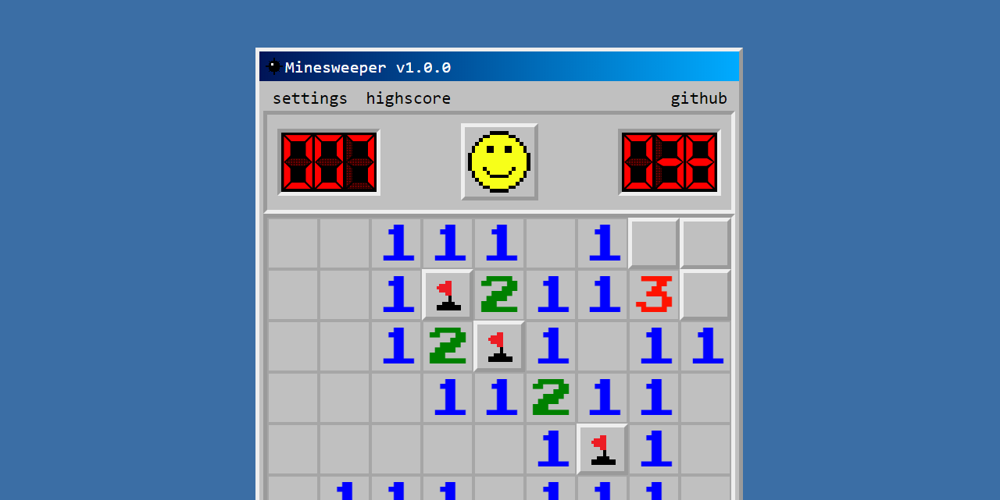

# Angular Minesweeper

<!-- markdownlint-disable MD013 -->

   

<!-- markdownlint-enable MD013 -->

The classic Win98 Minesweeper game recreated for the web using Angular

> Click on the image to try out!

## Svelte version

Check out the Svelte implementation here: <https://github.com/alexaegis/svelte-minesweeper>
